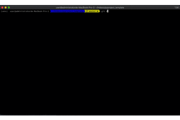

# Pyproject template 

## Demo

This project use several tools, including
* pytest
* isort
* black
* mypy
* bandit
* safety
* pylint
* commitlint

to format our code base and check security issues

## Install

1. Python dependencies:
    1. `virtualenv venv; . venv/bin/activate`
    2. `pip install poetry`
    3. `poetry install`
2. Npm dependencies, for linter, formatter and commit linter (optional):
    1. `brew install npm`
    2. `npm ci`

## How to Develop

1. Commit using commitizen UI: `npm run commit`

    
## Run

1. test: `npm run test`
2. Run all linter before commitment would save some effort: `npm run check`
